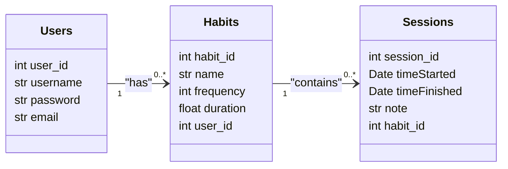

# Habit Trakcer
> Inzynieria Oprogramowania

## Overview

```mermaid
classDiagram
    direction LR

    class Users {
        int user_id
        str username
        str password
        str email
    }

    class Habits {
        int habit_id
        str name
        int frequency
        float duration
        int user_id
    }
    
    class Sessions{
      int session_id
      Date timeStarted
      Date timeFinished
      str note
      int habit_id
    }

    Users "1"-->"0..*" Habits : "has"
    Habits "1"-->"0..*" Sessions: "contains"
```