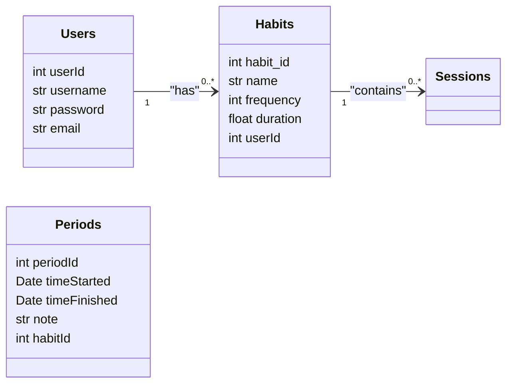

# Habit Trakcer
> Inzynieria Oprogramowania

## Usage

Add your mongoDB URI and Google OAuth credentials to the config.env file

```
# Install dependencies
npm install

# Run in development
npm run dev

# Run in production
npm start
```

## Overview



## Dependencies
- express
    - routing framework
- mongoose
    - work with mongodb
- connect-mongo
    - store sessions in mongodb
- express-session
    - creates sessions and cookies
- express-handlebars
    - template engine
- dotenv
    - configuration, environment variables
- method-override
    - PUT, DELETE request from templates
- moment
    - format dates
- passport
    - authentication
- passport-google-oauth20
    - google authentication
- nodemon
    - continuously runs the server
- cross-env
    - global environment variable for different OS